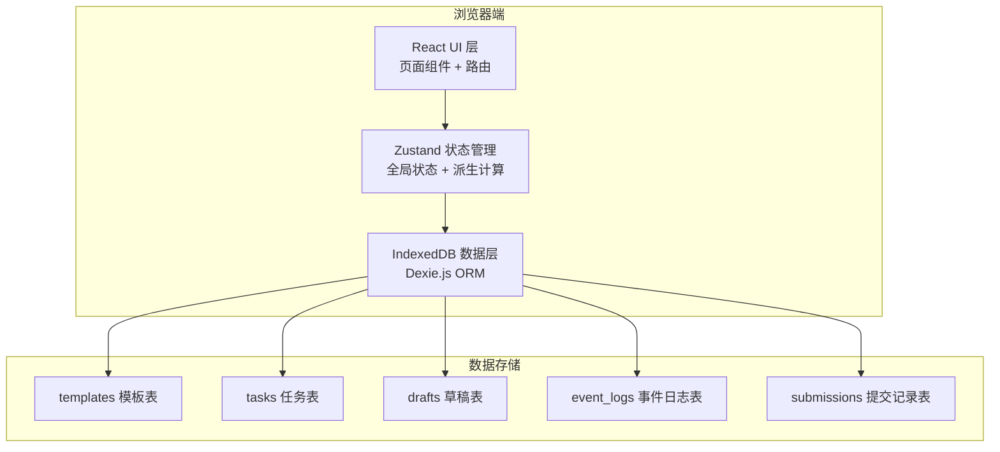
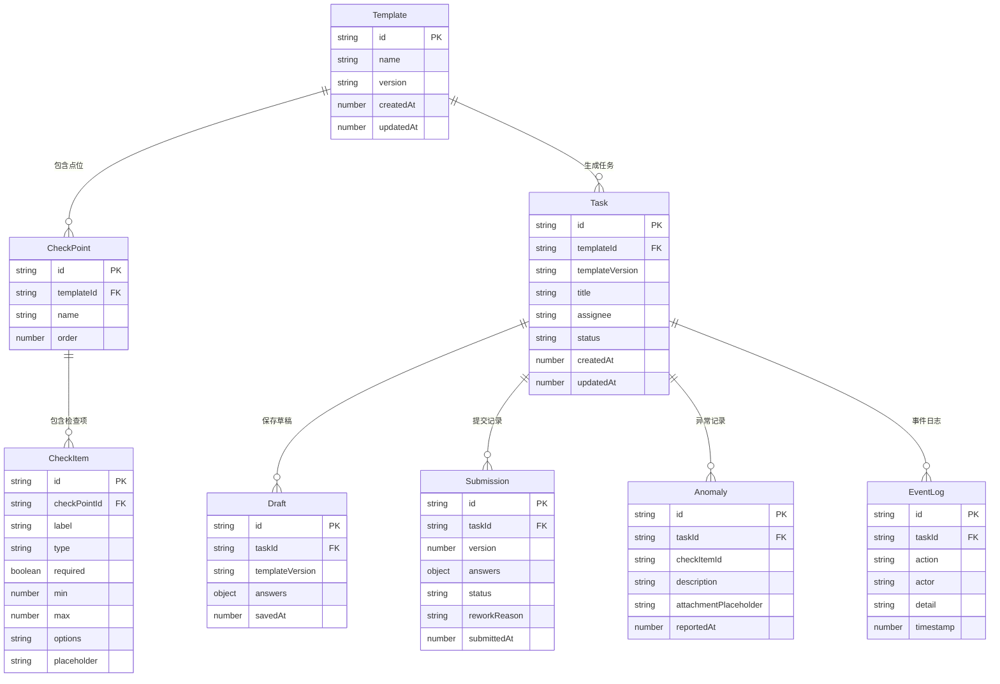

## 1. 架构设计



## 2. 技术说明

- **前端**：React 18 + TypeScript + TailwindCSS 3 + Vite
- **初始化工具**：vite-init (react-ts 模板)
- **后端**：无（纯前端离线应用）
- **数据库**：IndexedDB（通过 Dexie.js 操作）
- **状态管理**：Zustand
- **路由**：React Router DOM v6
- **图标**：lucide-react
- **导出**：原生 Blob + URL.createObjectURL 下载 JSON

## 3. 路由定义

| 路由 | 用途 |
|------|------|
| `/` | 首页 - 角色选择 |
| `/inspector/tasks` | 巡检员 - 任务列表 |
| `/inspector/inspect/:taskId` | 巡检员 - 巡检填写 |
| `/inspector/anomalies` | 巡检员 - 异常列表 |
| `/admin/templates` | 管理员 - 模板配置 |
| `/admin/templates/:id` | 管理员 - 模板编辑 |
| `/admin/review` | 管理员 - 审核列表 |
| `/admin/review/:taskId` | 管理员 - 审核详情/退回 |
| `/logs` | 事件日志 |
| `/export` | 数据导出 |

## 4. 数据模型

### 4.1 数据模型定义



### 4.2 数据定义语言（IndexedDB Schema via Dexie）

```typescript
import Dexie, { Table } from 'dexie'

interface Template {
  id: string
  name: string
  version: string
  checkpoints: CheckPoint[]
  createdAt: number
  updatedAt: number
}

interface CheckPoint {
  id: string
  name: string
  order: number
  items: CheckItem[]
}

interface CheckItem {
  id: string
  label: string
  type: 'text' | 'number' | 'select' | 'attachment'
  required: boolean
  min?: number
  max?: number
  options?: string[]
  placeholder?: string
}

interface Task {
  id: string
  templateId: string
  templateVersion: string
  title: string
  assignee: string
  status: 'available' | 'in_progress' | 'submitted' | 'rework' | 'approved'
  createdAt: number
  updatedAt: number
}

interface Draft {
  id: string
  taskId: string
  templateVersion: string
  answers: Record<string, unknown>
  savedAt: number
}

interface Submission {
  id: string
  taskId: string
  version: number
  answers: Record<string, unknown>
  status: 'pending' | 'approved' | 'rework'
  reworkReason?: string
  submittedAt: number
}

interface Anomaly {
  id: string
  taskId: string
  checkItemId: string
  description: string
  attachmentPlaceholder: string
  reportedAt: number
}

interface EventLog {
  id: string
  taskId: string
  action: 'claim' | 'save_draft' | 'submit' | 'rework' | 'approve' | 'anomaly' | 'reject'
  actor: string
  detail: string
  timestamp: number
}

class InspectionDB extends Dexie {
  templates!: Table<Template>
  tasks!: Table<Task>
  drafts!: Table<Draft>
  submissions!: Table<Submission>
  anomalies!: Table<Anomaly>
  eventLogs!: Table<EventLog>

  constructor() {
    super('InspectionDB')
    this.version(1).stores({
      templates: 'id, name, version',
      tasks: 'id, templateId, assignee, status',
      drafts: 'id, taskId',
      submissions: 'id, taskId, version',
      anomalies: 'id, taskId, checkItemId',
      eventLogs: 'id, taskId, action, timestamp'
    })
  }
}
```

## 5. 核心业务规则

### 5.1 校验规则
- **必填校验**：提交时遍历所有 required=true 的检查项，未填则阻止并高亮
- **数值越界**：type=number 的检查项，值超出 [min, max] 范围则阻止
- **旧模板草稿**：草稿的 templateVersion 与当前模板 version 不一致则阻止提交，提示"模板已更新，请重新填写"
- **重复提交**：任务状态为 submitted 时阻止再次提交
- **状态覆盖**：更新任务时比较 updatedAt，若服务端（本地DB）更新时间更晚则拒绝

### 5.2 草稿机制
- 每次修改检查项值时自动保存到 IndexedDB（debounce 500ms）
- 保存时记录 savedAt 时间戳和 templateVersion
- 刷新页面时从 IndexedDB 恢复草稿，比对 templateVersion
- 草稿键为 taskId，一个任务只有一个草稿

### 5.3 退回返工机制
- 管理员退回时创建 Submission 记录（status=rework, reworkReason 填写原因）
- 保留旧 Submission 记录（version 递增）
- 巡检员重新提交时 version+1，创建新 Submission
- 事件日志记录每次退回和重新提交

### 5.4 异常上报
- 巡检员可对任意检查项标记异常
- 异常记录包含：检查项ID、描述、附件占位符、时间戳
- 附件使用占位记录（如 "[附件: 设备照片.jpg]"），不实际存储文件
- 异常列表页展示所有异常，按时间倒序

### 5.5 事件日志
- 所有操作均写入 eventLogs 表
- 日志类型：claim(领取)、save_draft(保存草稿)、submit(提交)、rework(退回)、approve(审核通过)、anomaly(异常上报)、reject(校验拒绝)
- 日志不可删除，只可查询和导出
